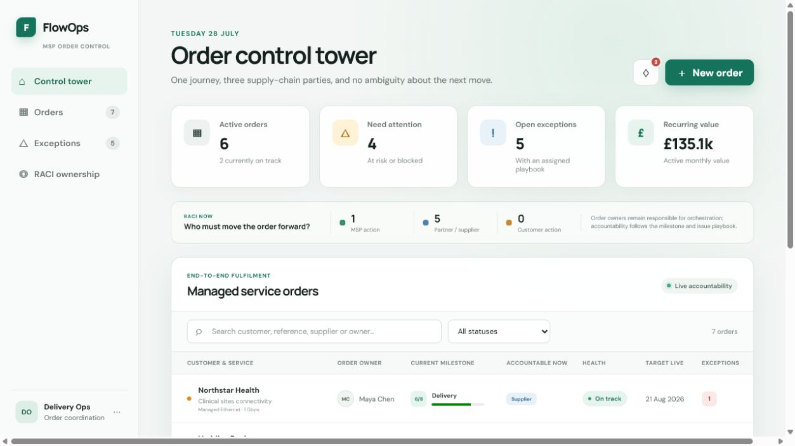
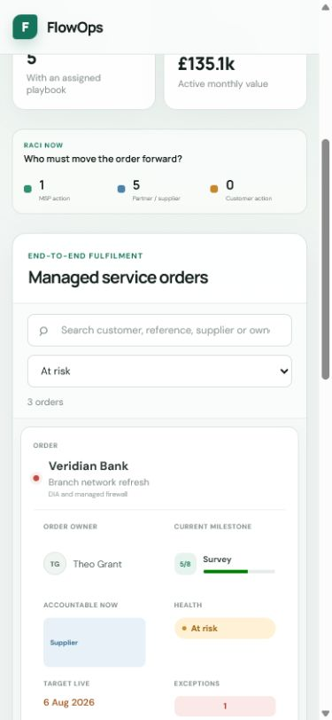

# FlowOps

FlowOps is a frontend SaaS dashboard prototype designed around a
production-style architecture. It gives MSP project coordinators one
order-control workspace for managing customer services across a third-party
ordering partner and a fulfilment supplier.

It connects the commercial request, CRF, partner reference, supplier portal
reference, delivery milestones, exceptions, RACI ownership, and owner
notifications in one tracker. The product is designed around one operational
question:

> What needs to happen next, and who is accountable for making it happen?

## Product preview



<p align="center">
  
</p>

## Core workflows

### End-to-end order journey

Every order receives an eight-stage tracker:

1. Customer agreement
2. CRF raised
3. Partner order accepted
4. Supplier order placed
5. Survey and design
6. Delivery in progress
7. Activation and test
8. Handover complete

Each milestone contains:

- A clear completion outcome
- The coordinator's next action
- Responsible and accountable parties
- Consulted and informed stakeholders
- Automatic progress calculation
- A guarded milestone-completion action

### Reference chain

The tracker keeps the three operational references together:

- MSP customer request form (CRF)
- Third-party ordering partner reference
- Supplier portal order reference

The new-order wizard starts a tracker at the correct milestone based on the
references already available. Missing downstream references remain visibly
pending.

### Exception playbooks

Coordinators can log common delay causes:

- Excess Construction Charges (ECC)
- Wayleaves
- Site access
- Survey failure
- Network capacity
- Stock or lead-time delays
- Order data mismatches
- Number porting

Every exception automatically states:

- Which organisation is accountable
- Which role must resolve it
- What the coordinator should do next
- The next checkpoint date

Orders with blocking exceptions cannot complete their current milestone until
the issue is resolved. Resolving the final exception returns the order to an
on-track state.

### RACI accountability

RACI changes with the current milestone. For example:

- The MSP is accountable for CRF quality and supplier portal submission.
- The third-party partner is accountable for accepting the partner order.
- The supplier is accountable during survey, design, and delivery.
- The customer becomes accountable for consent, access, or commercial
  decisions such as ECC approval.

The MSP order owner remains responsible for orchestration even when another
party is accountable for the outcome.

### Owner notifications

FlowOps creates an in-app notification when:

- A new tracker is assigned
- A milestone is reached
- An exception is logged
- An exception is resolved

The demo shows the event and intended recipient. A production backend can route
the same event through email, Microsoft Teams, Slack, a service desk, or a
workflow platform using an outbox/event integration.

## Dashboard

- Active, at-risk, blocked, and completed orders
- Open exception count
- Active monthly recurring value
- Current accountability split across MSP, external supply chain, and customer
- Search across customers, products, sites, owners, suppliers, and references
- Status filtering
- Semantic desktop table transforming into labelled mobile cards
- Loading, empty, and API error states

## Run locally

Prerequisite: Node.js 20.19 or newer.

```bash
npm install
npm run dev
```

Quality checks:

```bash
npm run test
npm run lint
npm run build
```

## Data modes

All network and persistence logic lives in `src/api/projects.ts`.

### Demo mode

Without an API URL, FlowOps loads realistic MSP orders from
`public/projects.json` and saves created or updated orders in browser local
storage. This makes creation, milestone advancement, exception logging, and
resolution usable in a static frontend.

### REST mode

Copy `.env.example` to `.env` and set:

```text
VITE_API_URL=https://api.example.com
```

The frontend will use:

- `GET {VITE_API_URL}/projects`
- `POST {VITE_API_URL}/projects`
- `PATCH {VITE_API_URL}/projects/{id}`

The API boundary can be renamed to `/orders` when a production contract is
introduced without changing the UI components.

## Architecture

```text
src/
├── api/
│   └── projects.ts
├── components/
│   ├── FeedbackMessage.tsx
│   ├── StatusBadge.tsx
│   └── SummaryCard.tsx
├── features/
│   ├── dashboard/
│   │   └── summary.ts
│   ├── orders/
│   │   ├── NotificationCentre.tsx
│   │   ├── OrderDetailModal.tsx
│   │   └── orderJourney.ts
│   └── projects/
│       ├── ProjectFilters.tsx
│       ├── ProjectForm.tsx
│       ├── ProjectModal.tsx
│       └── ProjectTable.tsx
├── lib/
│   └── formatters.ts
├── App.tsx
├── main.tsx
├── styles.css
└── types.ts
```

### State ownership

- TanStack Query owns order data, caching, optimistic updates, and rollback.
- React owns filters, open panels, selected order, and in-app notifications.
- The three-step form owns its strongly typed values and validation.
- Pure journey functions own stage definitions, RACI, progress, and playbooks.

Redux is intentionally omitted because the complex state is remote state,
which TanStack Query already handles.

## Architectural trade-offs

- **Static demo data behind a typed service layer:** the current portfolio is
  loaded from `public/projects.json`, while components depend only on the
  typed API boundary. A real REST service can replace the demo adapter without
  rewriting the interface.
- **Browser persistence for the prototype:** create and update workflows use
  local storage in demo mode. This makes the hosted frontend interactive, but
  it is not presented as durable multi-user persistence.
- **TanStack Query instead of Redux:** server-state caching, mutations,
  optimistic updates, and rollback are handled by React Query; small interface
  state stays local to React components.
- **Semantic table plus mobile cards:** desktop users retain column-by-column
  comparison, while responsive CSS turns each row into a labelled card without
  duplicating the React markup.
- **Plain CSS instead of Tailwind or a UI library:** this keeps responsive
  layout, focus treatment, and component styling visible as portfolio evidence.
- **In-app notification events:** milestone and exception events demonstrate
  the workflow. Email, Teams, Slack, or service-desk delivery remains a roadmap
  integration that requires a backend.

## Accessibility

- Skip navigation and visible keyboard focus
- Semantic headings, landmarks, tables, captions, progress, and fieldsets
- Dialog names, descriptions, Escape handling, and focus restoration
- Linked field errors and first-invalid-field focus
- Status announcements for successful and failed updates
- Plain-language accountability and exception instructions
- Reduced-motion support

## Test coverage

Vitest and React Testing Library cover:

- Portfolio summary rules
- Search and status filters
- Accessible order table rendering
- Wizard opening, closing, validation, success, and rollback
- Correct tracker stage from supplied references
- RACI and exception-playbook visibility
- Milestone advancement and owner notifications

See [PROJECT_PLAN.md](./PROJECT_PLAN.md) for the next delivery phases.
