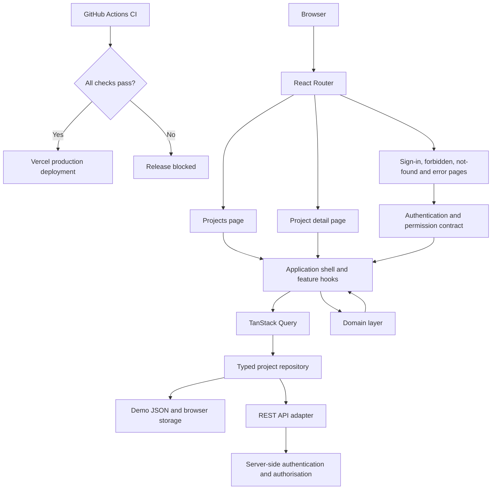

# Trackvera architecture

Trackvera is a frontend SaaS dashboard prototype for orchestrating managed
service orders across an MSP, third-party partner, supplier, and customer. The
codebase separates presentation, application state, domain rules, and data
access so the demo adapter can be replaced by a production API without
rewriting the interface.

## Runtime overview

## Layer responsibilities

| Layer | Responsibility |
| --- | --- |
| Presentation | Accessible pages, tables, mobile cards, forms, dialogs, notifications, and recovery views |
| Routing | Protected routes, project URLs, URL-backed portfolio state, and not-found handling |
| Application | Query orchestration, optimistic updates, rollback, capability decisions, and user feedback |
| Domain | Filtering, sorting, pagination, summaries, milestone progression, RACI, and exception playbooks |
| Repository | Typed reads and mutations independent of the selected data source |
| Demo adapter | Static project seed plus per-browser persistence for the hosted prototype |
| REST adapter | Production-facing HTTP contract configured through `VITE_API_URL` |
| Delivery | Automated lint, type-check, tests, production build, E2E journeys, and gated deployment |

## Data and mutation flow

1. A route renders a presentation page.
2. The application shell requests project data through TanStack Query.
3. The repository selects demo storage or the REST API from the public runtime
   configuration.
4. Pure domain functions derive summaries, filtered lists, milestones, RACI,
   and exception guidance.
5. Mutations update the query cache optimistically and retain a snapshot.
6. A failed request restores that snapshot and exposes an accessible recovery
   message.

## Security boundary

The frontend authentication provider uses password-free mock identities to
demonstrate protected routes, session expiry, and permission-aware controls.
It improves the interface but is not an authorisation boundary. A production
API must authenticate every request, enforce tenant and resource permissions,
and record audit events independently of what the browser displays.

See [SECURITY.md](./SECURITY.md) for the complete permission matrix and
production replacement checklist.

## Delivery boundary

`.github/workflows/ci.yml` is the required quality gate. It runs against pull
requests and `main`, including Playwright journeys against the compiled Vite
bundle. `.github/workflows/deploy.yml` is triggered only after the CI workflow
completes successfully for a push to `main`; failed or cancelled checks cannot
start the production deployment job.

